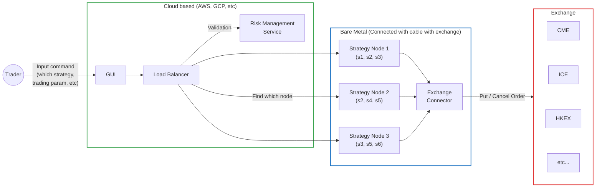

Based on what I did learned, overall the Trader Facing HFT System will look like this.

In other companies production system, this can be different, but the main point still almost the same.

- **Trader** operates the system using GUI
- **Risk Management System (RMS)** will check the risk & reject Trader's command if RMS detect some risk.
- **Strategy service** will decide what to buy or sell, at what price, when to cancel
- **Exchange connector** will convert the request that system understands into something that can be understand by specific exchanges.

*s1 – s6 is strategy that can be executed by Strategy Node X*

