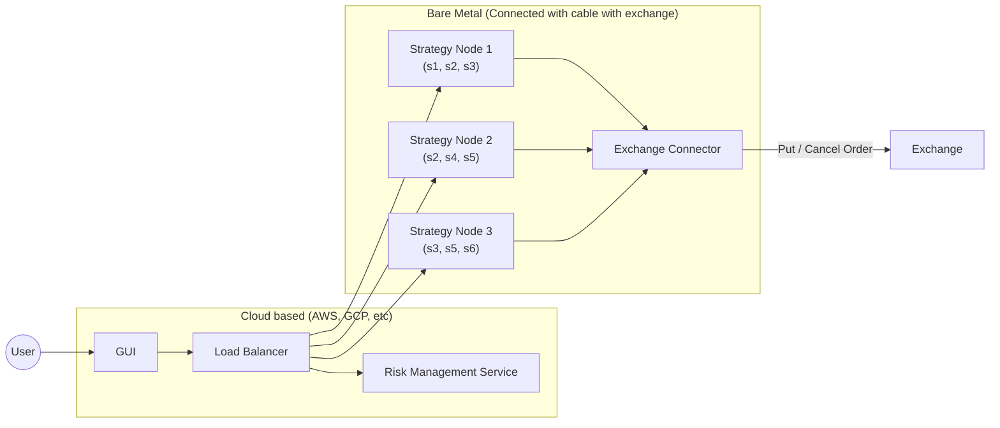

```mermaid
flowchart LR
    User((User)) --> GUI

    subgraph Cloud["Cloud based (AWS, GCP, etc)"]
        GUI --> LB[Load Balancer]
        LB --> Risk[Risk Management Service]
    end

    subgraph BareMetal["Bare Metal (Connected with cable with exchange)"]
        N1["Strategy Node 1<br/>(s1, s2, s3)"]
        N2["Strategy Node 2<br/>(s2, s4, s5)"]
        N3["Strategy Node 3<br/>(s3, s5, s6)"]
        EC[Exchange Connector]
        N1 --> EC
        N2 --> EC
        N3 --> EC
    end

    LB --> N1
    LB --> N2
    LB --> N3
    EC -- "Put / Cancel Order" --> EX[Exchange]
```