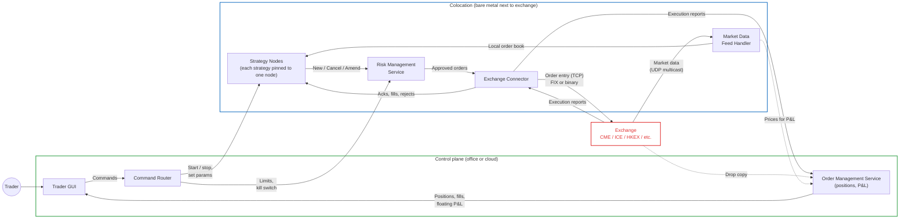
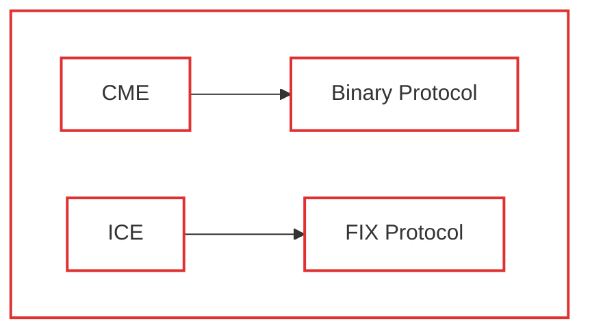
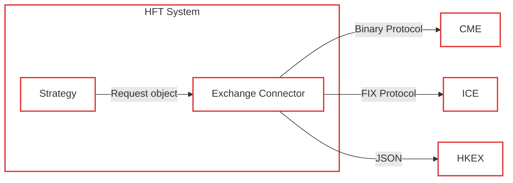

Based on what I did learned, overall the Trader Facing HFT System will look like this.

In other companies production system, this can be different, but the main point still almost the same.

- **Trader** operates the system using GUI
- **Risk Management System (RMS)** will check the risk & reject Trader's command / Strategy execution if RMS detect some risk.
- **Strategy service** will decide what to buy or sell, at what price, when to cancel automatically based on the data it knows (Current price, how many stock we own, floating profit, etc).
- **Exchange connector** will convert the request that system understands into something that can be understand by specific exchanges.
- **Order Management System** tells you have many stocks you have, running order status, floating profit / loss.
- **Market Data Feed Handler** listening the exchange activity and updating it's own orderbook.

*s1 – s6 is strategy that can be executed by Strategy Node X*

The reason we require Exchange Connector because each exchange might having different way of communicating, we called this **protocol**.

This is just an example

For example, Chicago Mercantile Exchange (CME) might need to communicate using Binary Protocol in order to send order to that exchange.

Or maybe Intercontinental Exchange (ICE) might want to communicate using FIX Protocol.

So **Exchange Connector** is not only for forwarding the request from the **Trader** to the **Exchange**, but also acts as an adapter for the request object to a form that can any **Exchange** can understand.

