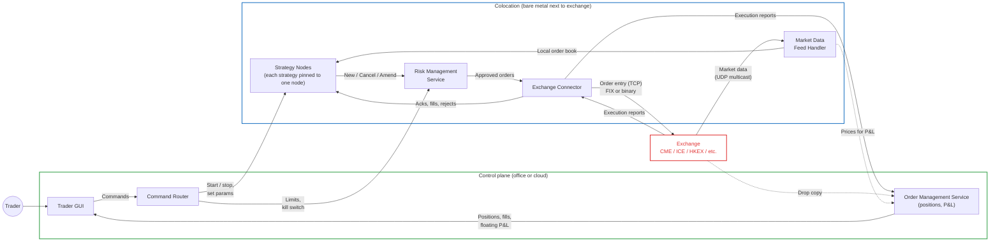
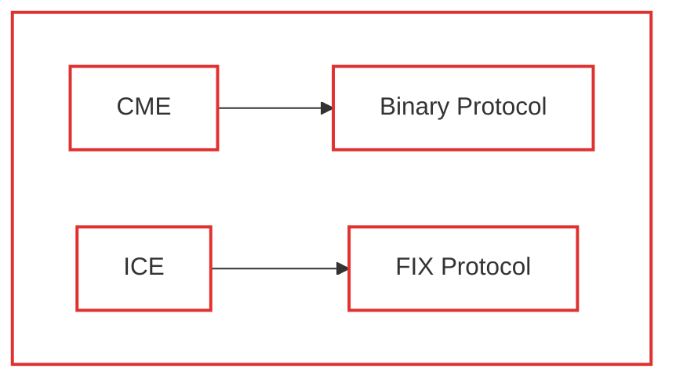
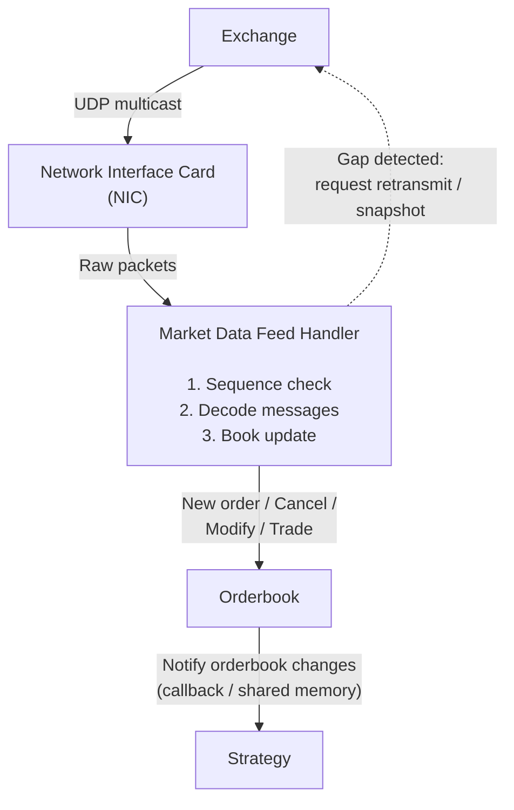

Based on what I did learned, overall the Trader Facing HFT System will look like this.

In other companies production system, this can be different, but the main point still almost the same.

- **Trader** operates the system using GUI
- **Risk Management System (RMS)** will check the risk & reject Trader's command / Strategy execution if RMS detect some risk.
- **Strategy service** will decide what to buy or sell, at what price, when to cancel automatically based on the data it knows (Current price, how many stock we own, floating profit, etc).
- **Exchange connector** will convert the request that system understands into something that can be understand by specific exchanges.
- **Order Management System** tells you have many stocks you have, running order status, floating profit / loss.
- **Market Data Feed Handler** listening the exchange activity and updating it's own orderbook.



*s1 – s6 is strategy that can be executed by Strategy Node X*

The reason we require Exchange Connector because each exchange might having different way of communicating, we called this **protocol**.

This is just an example

For example, Chicago Mercantile Exchange (CME) might need to communicate using Binary Protocol in order to send order to that exchange.

Or maybe Intercontinental Exchange (ICE) might want to communicate using FIX Protocol.



So **Exchange Connector** is not only for forwarding the request from the **Trader** to the **Exchange**, but also acts as an adapter for the request object to a form that can any **Exchange** can understand.

#

**Market Data Feed Handler** acts as a listener for every market activity on the **Exchange**.

**Exchange** will sends a raw packets, each of packets contains >= 1 message.

Here's a simplified example how packets looks like:

```
Packet #1001
  Sent at   : 09:30:00.000123456
  Messages  : 4

  [1] New order   order 5003   ABC   Buy    500 @ 100.50
  [2] Modify      order 5001   ABC   qty 300 -> 200   (price 100.40)
  [3] Cancel      order 4998   ABC
  [4] Trade       ABC   100 @ 100.60   (sell order 5002 partly filled)
```

This will means:

1. Someone created an order to buy 500 unit `ABC` stock at $100.50 with ID 5003
2. Someone modify an order from 300 to 200 unit for `ABC` stock at price level $100.40 with ID 5001
3. Someone canceled the order for buying stock `ABC` with ID 4998
4. Trade happened for stock `ABC`, sold 100 unit, but partly filled with ID 5002.

With these information, we can create the orderbook that looks like this (Simplified).

```
          Buy           |           Sell
   Qty       Price      |      Price       Qty
   800      100.50      |     100.60       200
   600      100.40      |     100.70       400
   900      100.30      |     100.80       700
```

And then, based on the data from Orderbook, Strategy service now can decide what to do on `ABC` stock (Buy, Sell, Modify, Cancel, etc).

You may wondering, why we need sequence ID for each packets?

**Exchange** sends packets using UDP protocol, UDP is fast, but unreliable, it's using fire and forget mechanism.

```
   Exchange                        Feed Handler
      |                          (last seq = 100)
      |                                  |
      |------ packet #101 -------X       |   lost on the network
      |                                  |
      |------ packet #102 -------------->|   expected #101, got #102
      |                                  |   -> gap! #101 is missing
      |                                  |   -> hold #102, pause strategy
      |                                  |
      |<----- resend #101 ---------------|
      |                                  |
      |------ packet #101 -------------->|   apply #101, then #102
      |                                  |   last seq = 102, book OK
```

Assuming we're already in sequence number `100`, we expect to process packet number `101` in next, because we're using UDP, there's a chance packet number `101` got lost, then comes packet number `102`, but we haven't processed packet number `101`. 

There's must be something wrong, so when packet got lost, we can ask to **Exchange** again to retransmit packet no `101`.



